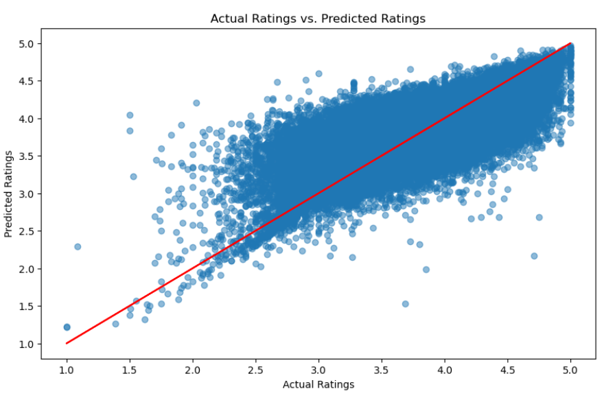
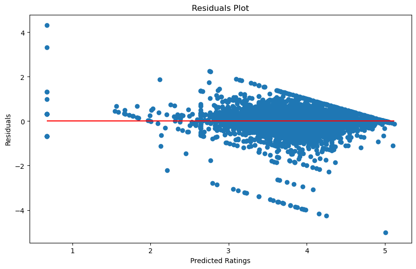
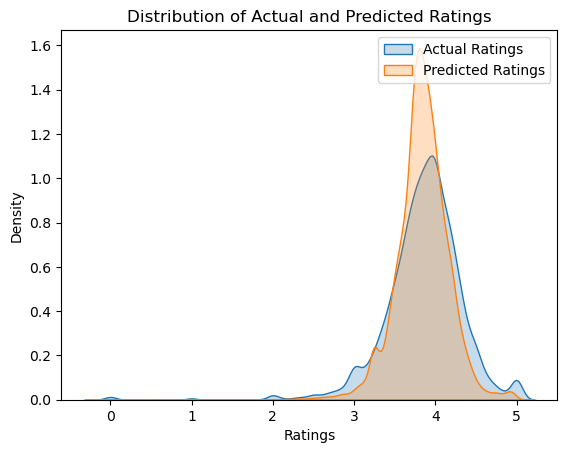
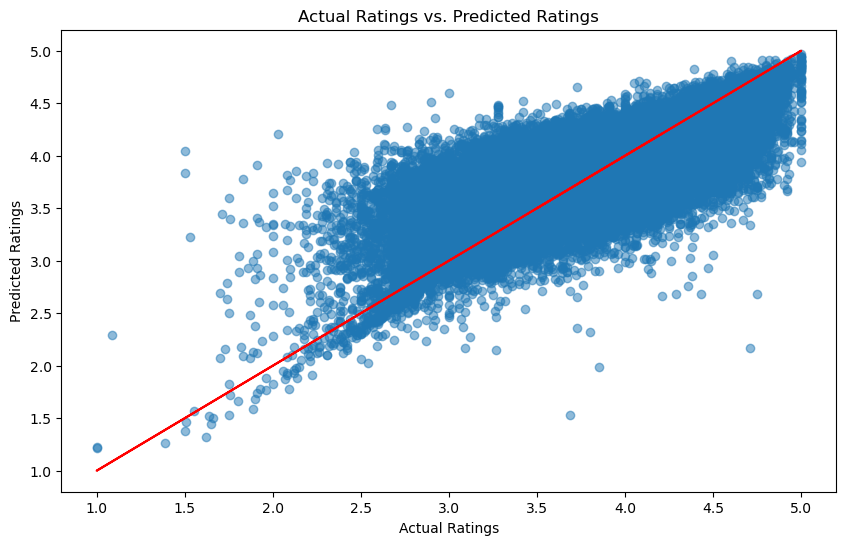
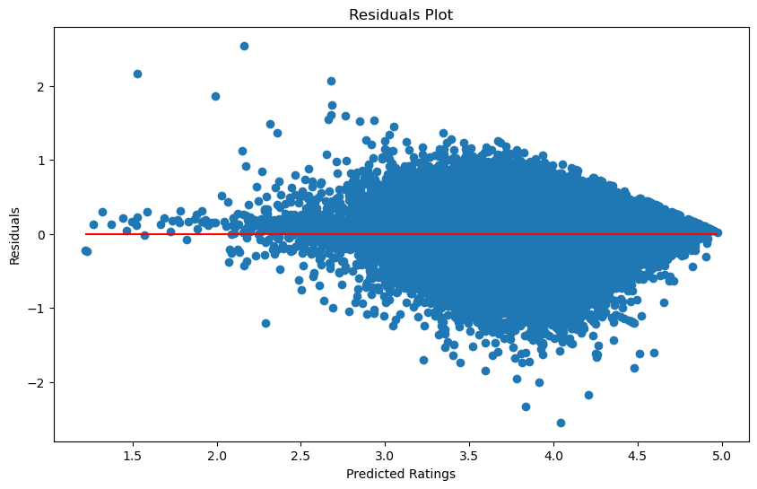
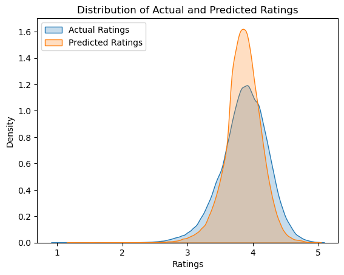

# Unveiling Literacy Insights: Harnessing The Power of Data for Predictive Modeling of Book Ratings

## Team Members
- Abdulla Mashaly [@AbdullaMashaly](https://github.com/AbdullaMashaly)
- Jeremy Magee [@JpMageeGitHub](https://github.com/JpMageeGitHub)
- Akhil Karandikar [@KarandikarA](https://github.com/KarandikarA)
- Lori Girton [@lorigirton](https://github.com/lorigirton)

## Overview

This GitHub repository contains the code and process documentation for the exploration and analysis of the "Goodreads Book Reviews" dataset sourced from Kaggle. The dataset provides comprehenive information about book reviews including details about authors, ratings, formats, and more. Our team used this data to create a machine learning model that could predict book review ratings.

## Dataset Source
The original dataset can be found on Kaggle: [Goodreads Book Reviews](https://www.kaggle.com/datasets/pypiahmad/goodreads-book-reviews1).

## Data Cleaning Process

1. **Data Loading with Spark:** 

    

    - The dataset was initially loaded using Spark to efficiently handle the large file is (`Data_partitioning.ipynb`). This notebook demonstrates the process of data partitioning using Apache Spark. It covers the steps of reading a large JSON dataset, inspecting its schema and size, repartitioning it into smaller chunks for efficient processing, and then writing these partitions back to disk. This approach is essential for handling and processing large datasets effectively in Spark.. 
    -`Data_Import.ipynb` file utilized Spark to read in repartitioned files back in and dropped columns we did not think would be helpful (`['asin','country_code', 'book_id','description', 'isbn', 'similar_books', 'title_without_series','is_ebook', 'work_id' , 'link', 'image_url', 'url', 'edition_information', 'kindle_asin','language_code', 'publication_day', 'publication_month', 'publisher', 'title']`). and were left with the following columns:

    

    - Next rows with empty strings were filtered out as well as rows with empty strings in any column. 
    - We dropped duplicate ‘isbn13’. A new column was created named “to_read_count” was created after exploding the “popular_shelves” array and capturing the number of people who had the book in their “To read” cart. After the creation, we dropped the “popular_shelves” column. 
    - We then joined the original DataFrame with the aggregated DataFrame on the “isbn13” column, made the column ‘series’ binary. We then made `df_authors_exploded` DataFrame by selecting only the “authors”, and “isbn13” columns from the main df. We exploded the “author” column and created “unique_author_id” column and dropped the “author” column. We then created a CSV ("books_cleaned_sample") out of the final column. 

2. **Column Selection:**
    - We narrowed down the dataset by keeping only the essential columns, including authors, average rating, country code, format, ebook information, ISBN13, number of pages, popular shelves, publication year, ratings count, series information, text reviews count, title, and author ID.

3. **Data Filtering:**
    - Formats were further filtered to include only paperback, ebooks, and hardcover.
    - Duplicate records with the same ISBN13 were dropped.
    - Records with null values were removed to ensure data quality.

4. **Feature Engineering:**
    - Series Encoding: A binary column, 'series', was created to indicate whether a book is part of a series (1) or not (0).
    - Authors: Author columns was replaced by author's average rating, by merging data from Detailed Information of Authors (goodreads_book_authors.json.gz), average of authors average ratings where taken for books with more than one author
    - Formats: The three most popular formats Paperback, Hardcover and Ebook where kept the same and the rest of formats where aggreagated together as other.  

5. **Pandas DataFrame and CSV Export:**
    - A sample of cleaned data was converted to a Pandas DataFrame, making it more manageable. 
    - The final cleaned dataset was exported to a CSV file and shared with the team.

## Data Exploration

1. **Initial Exploration:**
    - Visualizations were created to explore the distribution of key features, such as average rating, number of pages, and publication year in "EDA_sample". There were several records with year published after 2023 (scatter plot 1). After taking these out, there were still other published years too far back (scatter plot 2). We also noticed the column with number of pages had over half the records with 0 pages (bar graph 1). Identifying these outliers in the 'num_pages' and 'publication_year' columns, allowed for a more focused analysis.

    

        
    

    

        
    

    

        
    

3. **Further Data Cleaning to Optimize Models:**
    - **Data Cleaning Iterations:**
    - We cleaned the data after beginning the model two additional times ("books_cleaned_sample2", and "books_cleaned_sample3").
    - We filtered out outliers within the publication_year column so that we dropped records before 1900 or after 2023
    -The `books_cleaned_sample3` was created to add in the genres df, extract the fields, and create new columns ('children', 'comics, graphic', 'fantasy, paranormal', 'fiction', 'history, historical fiction, biography', 'mystery, thriller, crime', 'non-fiction', 'poetry', 'romance', 'young-adult'). 
    - After the creation, we gave a numerical value to each column as 0 (if the book did not contain this genre keyword) or a 1 (the book did contain this genre keyword). 
    - We then joined this dataframe with the previous data frame on “book_id."

## Machine Learning Model

1. **Neural Network Model:**

    **First Trial:**
    - Due to the diverse set of features and the objective of predicting a single variable from various inputs, a neural network model was implemented. 
    - The machine learning model must demonstrate meaningful predictive power of at least 75% classification accuracy or 0.80 R-squared.
    - The model is tuned using Keras Tuner to find the optimal hyperparameters.
    - Model Summary: 
        - **Activation Function**: Sigmoid
        - **Input Units**: 70
        - **Number of Layers**: 4
        - **Units in Each Layer**: [224, 128, 224, 32]
        - **Learning Rate**: 0.000225
    - Results: The model achieved the following performance metrics:
        - **Mean Absolute Error (MAE)**: 0.2106
        - **Mean Squared Error (MSE)**: 0.1196
        - **R-squared**: 0.4824
    - Visualizations: The scatter plot displays the correlation between actual and predicted ratings, indicating model accuracy with points close to the red line of perfect prediction. The residuals plot highlights prediction errors, where points near the horizontal line suggest smaller residuals and better model performance. The distribution plot compares the overall trend in actual and predicted ratings, with similar shapes implying that the model captures the general pattern in the data. Below are the plots illustrating the actual vs. predicted ratings and the distribution of these ratings.
    - For more details on the analysis, refer to [NN_tuner notebook](ML%20Models/NN_Tuner.ipynb).
    

    
    
    
    

    **Final Trial:**
    - The model was constructed using a sequential API with multiple dense layers. The hyperparameters were optimized using Keras Tuner, which determined the best combination of activation functions, number of neurons, and learning rate.
    - The dataset used for the final model excluded ratings below 1 and ratings counts below 10.
    - The model was first validated using a 10% sample of the data, achieving an R-squared value of 0.5824, before being trained on the full dataset.
    - Model Summary: The model was trained on the dataset with the following configurations:
        - Activation function: tanh
        - Input units: 180
        - Number of layers: 3
        - Dense layer units: Varying from 192 to 64
        - Learning rate: Approximately 0.0006
        - Epochs: 100
        - Batch size: 32
    - Results:
        - **Mean Absolute Error (MAE)**: 0.1668
        - **Mean Squared Error (MSE)**: 0.0538
        - **R-squared**: 0.5881

        These metrics indicate a moderately accurate model for predicting book ratings.

    - Visualizations: The model's predictions are visualized through:
        - A scatter plot contrasting actual ratings vs. predicted ratings.
        - A residual plot showcasing the difference between actual and predicted ratings.
        - A distribution plot comparing the density of actual and predicted ratings.

    - Conclusion: The neural network provides a reliable method for predicting book ratings, with consistent performance across different data volumes. Further improvements could be explored by adjusting the model architecture or training parameters.

2. **Linear Regression Model:**
    - We noticed in the initial EDA that there was a linear relationship between average rating and author average rating (scatter plot 3) and decided to look at other features (scatter plots 4 & 5) which may have linear relationships to try a Linear Regression Model.  We also used an imputer in this model to account for outliers. The first try returned a .513 R-squared value with the original cleaned data. We tried changing the features used as well as including the more clean sample 3 data with no improvement in R-squared value. This model performed with a MSE 0.12 and R-Squared value of 0.52 (image 1). The second model where we plugged in a cleaner dataset provided a less reliable model with a R-Squared value of 0.48 (image 2). We believe this could be due to the imputer being used to plug in the mean for data with outliers and once those outliers were removed, it was less predictive.
   

        
    

    

        
    

    

        
    

    

        
    

    

        
    

    

3. **Random Forest Model:**

    -Since we were not able to improve on either of the first two regression models, we decided to bin our data into the following bins: `[0, 1, 2, 3, 4, 5]`, labels `[0, 1, 2, 3, 4]`, `include_lowest=True` to make the data ready for a classification model. We chose the Random Forest model because it is commonly used for classification tasks where the goal is to predict the class or category of an input based on its features.

    

        
    

   

        
    

## Repository Structure

-**/EDA:** Contains the Python scripts used for data exploration.
-**/ML Models:** Includes the script for the different models we explored.
-**//Resources:** Holds the csv files created after data cleaning.
-**//Visuals:** Contains the png files used in Presentation and README.
-**No folder:** Contains, gitignor, data preprocessing, and README files.
- **/Data_partitioning.ipynb:** Contains the code for data partitioning using Apache Spark, make sure to download the dataset from the source and change the path to the dataset, after running this notebook, run the data_import.ipynb to import the data into a pandas dataframe.

## Citations
Mengting Wan, Julian McAuley, "Item Recommendation on Monotonic Behavior Chains", in RecSys'18. [bibtex]
Mengting Wan, Rishabh Misra, Ndapa Nakashole, Julian McAuley, "Fine-Grained Spoiler Detection from Large-Scale Review Corpora", in ACL'19. [bibtex]
Wan, Mengting.(2023).goodreads.GitHub.https://github.com/MengtingWan/goodreads
Ahmad. (2023, October). Goodreads Book Reviews, Version 1. Retrieved November 22, 2023 from https://www.kaggle.com/datasets/pypiahmad/goodreads-book-reviews1

## Sources
- [Spark](https://spark.apache.org/)
- [Keras Tuner](https://keras-team.github.io/keras-tuner/)
- [TensorFlow](https://www.tensorflow.org/)
- [Scikit-learn](https://scikit-learn.org/stable/)
- [Pandas](https://pandas.pydata.org/)
- [Matplotlib](https://matplotlib.org/)
- [Seaborn](https://seaborn.pydata.org/)
- [NumPy](https://numpy.org/)
- [TensorFlow ADDONS](https://www.tensorflow.org/addons)    

